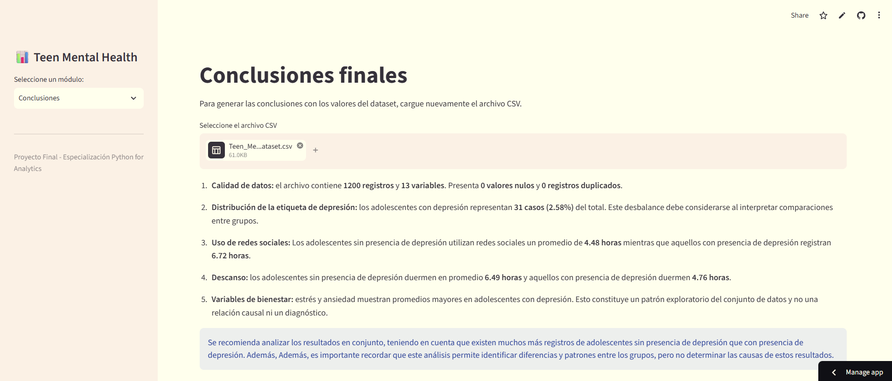

# Evaluacion_2

# Teen Mental Health – Análisis Exploratorio de Datos

## 1. Descripción del proyecto
Aplicación desarrollada en Python y Streamlit para realizar un análisis exploratorio de datos relacionados con la salud mental de adolescentes.

## 2. Objetivo
Analizar las características del dataset e identificar patrones relacionados con el uso de redes sociales, las horas de sueño y los niveles de estrés y ansiedad.

## 3. Funcionalidades
- Visualización de información general del dataset.
- Identificación de valores nulos y registros duplicados.
- Análisis estadístico de variables.
- Visualización de gráficos.
- Comparación de variables según la etiqueta de depresión.
- Filtros interactivos.
- Presentación de hallazgos y conclusiones.

## 4. Descripción de las variables principales

El dataset contiene información de 1,200 adolescentes y 13 variables relacionadas con sus hábitos de uso de redes sociales y bienestar.

Entre las principales variables analizadas se encuentran:

- **Edad:** edad de los adolescentes incluidos en el estudio.
- **Género:** permite comparar los resultados según el género de los participantes.
- **Uso diario de redes sociales:** cantidad de horas que los adolescentes dedican a las redes sociales durante el día.
- **Horas de sueño:** cantidad de horas que duermen diariamente.
- **Nivel de estrés:** nivel de estrés registrado para cada adolescente.
- **Nivel de ansiedad:** nivel de ansiedad registrado para cada adolescente.
- **Etiqueta de depresión (`depression_label`):** permite diferenciar los registros según dos categorías: 0 (ausencia de depresión) y 1 (presencia de depresión).

## 5. Capturas de la aplicación

A continuación, se presentan algunas pantallas de la aplicación desarrollada en Streamlit.

### 5.1 Pantalla principal

### 5.2 Carga de archivo

### 5.3 Calidad de datos

### 5.4 Análisis gráfico

### 5.5 Filtros interactivos

### 5.6 Conclusiones

## 6. Herramientas utilizadas
- Python
- Streamlit
- Pandas
- NumPy
- Matplotlib
- Seaborn

## 7. Ejecución
La aplicación se encuentra publicada en Streamlit Cloud y puede utilizarse directamente desde el enlace proporcionado.
También es posible ejecutarla desde una computadora siguiendo estos pasos:
1. Descargar los archivos del repositorio de GitHub.
2. Instalar las librerías necesarias mediante el comando pip install -r requirements.txt.
3. Iniciar la aplicación con el comando streamlit run app.py.
4. Cargar el archivo CSV desde la aplicación para visualizar los análisis y gráficos.

## 8. Autora
Andrea Aliaga Garma

Especialización Python for Analytics – 2026.
